<p align="center">
  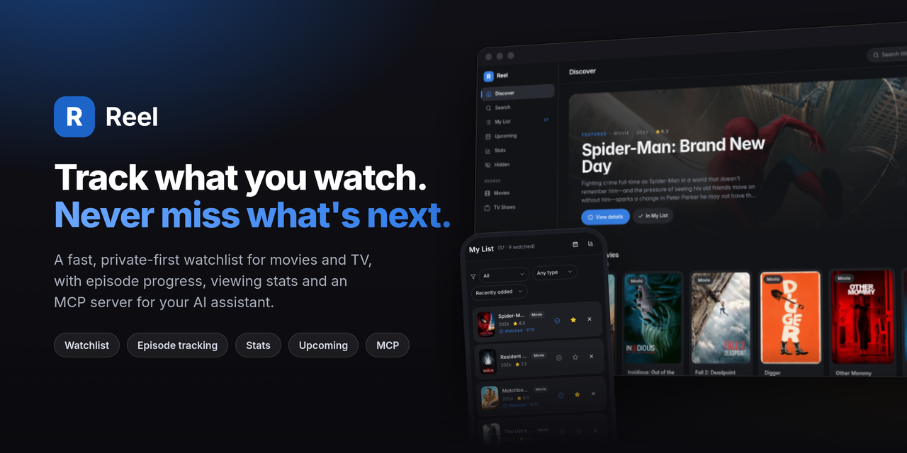
</p>

<h1 align="center">Reel</h1>

<p align="center">
  <b>Track what you watch. Never miss what's next.</b><br>
  A fast, private-first watchlist for movies and TV, with episode progress, viewing stats<br>
  and an MCP server so your AI assistant can manage your list too.
</p>

<p align="center">
  <a href="https://github.com/omsingh02/reel/actions/workflows/ci.yml"></a>
  <a href="LICENSE"></a>
  
  
  
  
  <a href="CONTRIBUTING.md"></a>
</p>

<p align="center">
  <a href="https://reel.omsingh.me"><b>Live demo</b></a> ·
  <a href="#screenshots">Screenshots</a> ·
  <a href="#features">Features</a> ·
  <a href="#quick-start">Quick start</a> ·
  <a href="#mcp-server">MCP server</a> ·
  <a href="CONTRIBUTING.md">Contributing</a>
</p>

---

## Screenshots

<p align="center">
  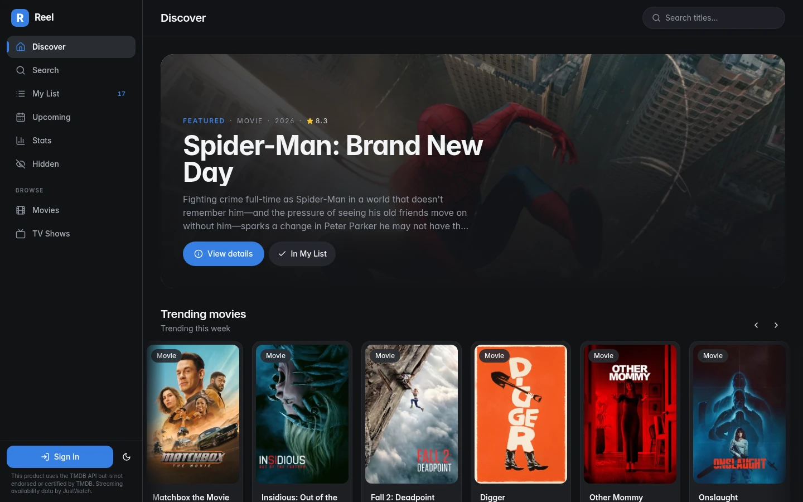
  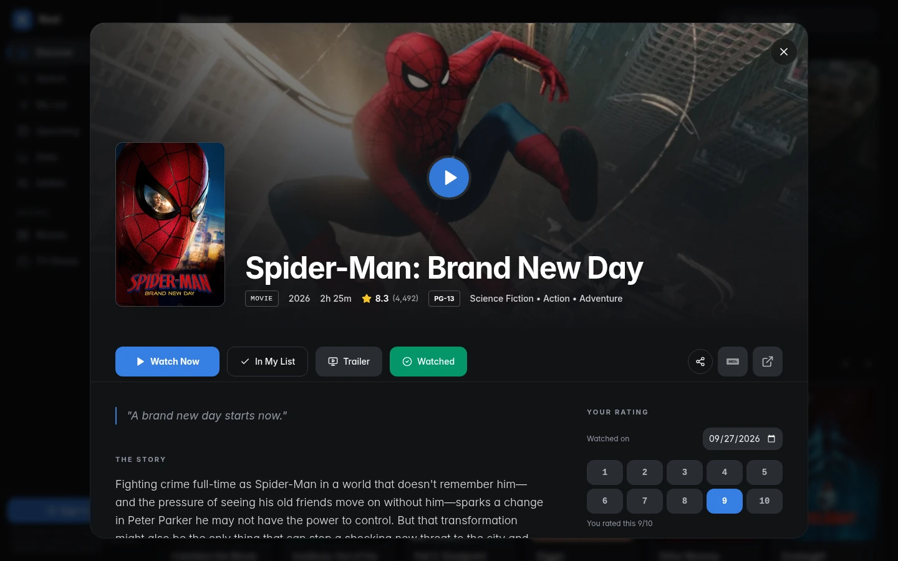
</p>
<p align="center">
  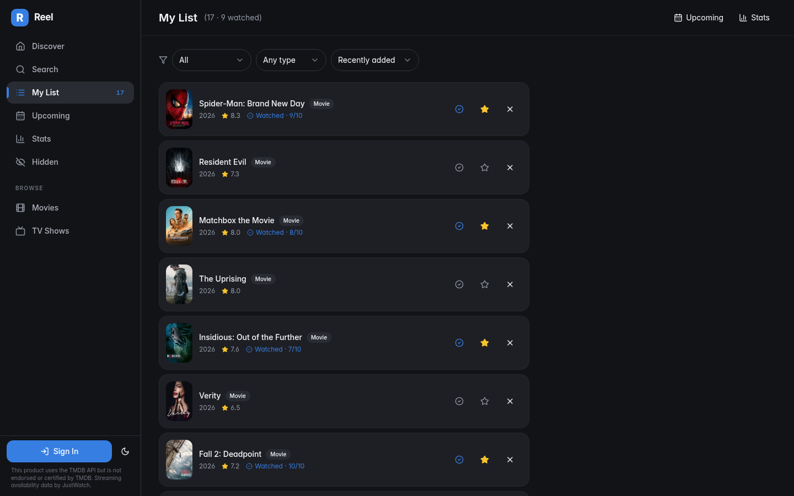
  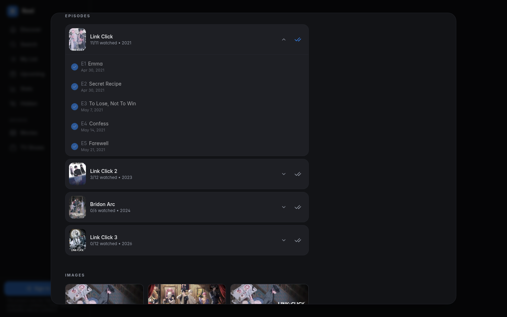
</p>
<p align="center">
  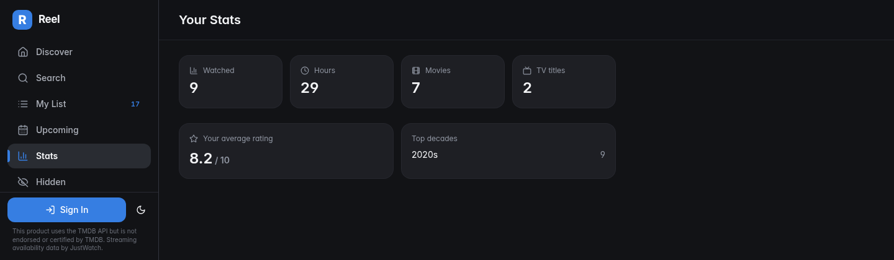
  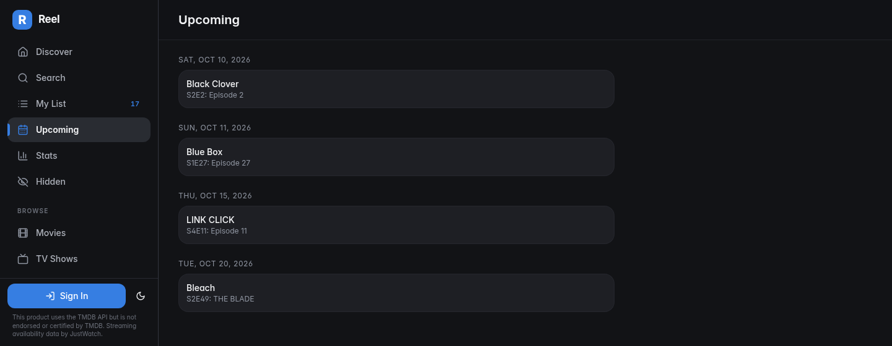
</p>

<details>
<summary><b>Mobile and light theme</b></summary>
<br>
<p align="center">
  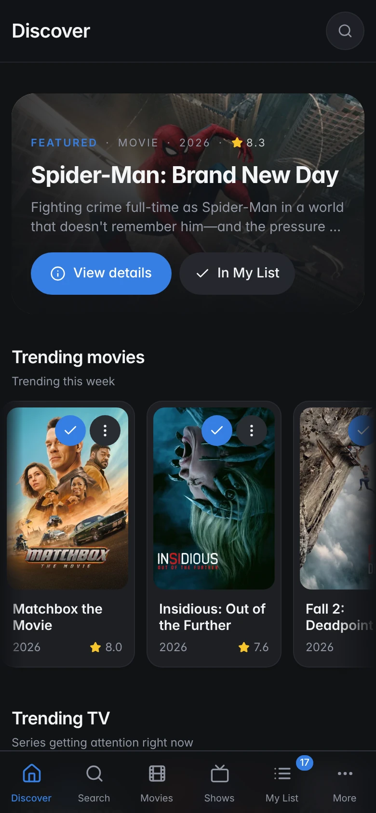
  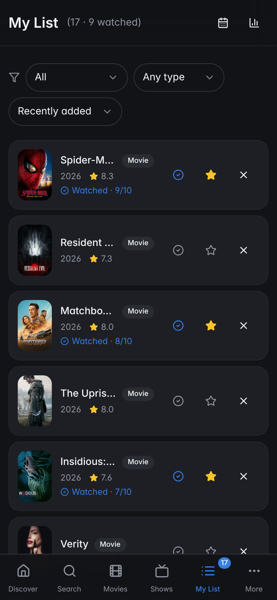
  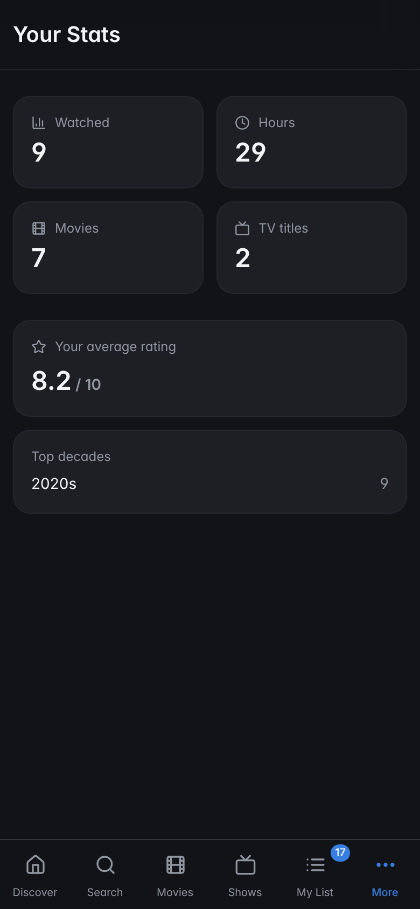
</p>
<p align="center">
  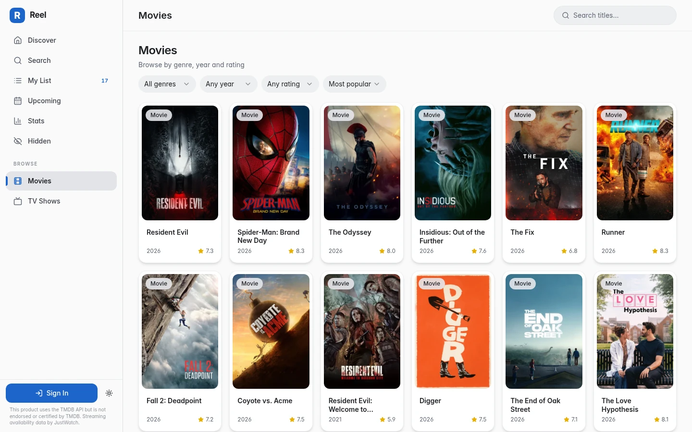
</p>
</details>

## Features

**Discover**
- Featured title plus trending and popular rails for movies and TV.
- Browse **Movies** and **TV Shows** by genre, year, minimum rating and sort order. Filters live in the URL, so a filtered view is shareable.
- Search with infinite scroll. If the Movies tab has no hits but TV does, it switches for you.
- Title pages with cast and crew, trailer, recommendations, similar titles, and **where to watch** by region (streaming, rent, buy).

**Track**
- **My List** with *to watch* / *watched* status, 1–10 ratings, a "watched on" date you can set to the past, filters, sorting (including *my rating*) and one-tap undo.
- **Per-episode progress** for shows, with whole-season toggles. Finish the last aired episode and the show is marked watched; mark a show watched and every aired episode is ticked.
- **Upcoming**: release dates and next-episode air dates for the titles in your list.
- **Stats**: titles watched, hours, movies vs shows, average rating and top decades.
- **Hidden titles**: "Not interested" removes a title from feeds and search, and a dedicated page brings it back.

**Yours, wherever you are**
- **Guest first.** Everything works without an account and is stored in your browser. Sign in later and your list, hidden titles and episode progress are merged into your account.
- Email and password accounts with verification and password reset. Per-user data is protected by Postgres Row Level Security.
- Dark and light themes, a responsive layout with a mobile bottom bar, and a web app manifest so it can be added to your home screen.
- Catalogue responses are cached locally for a few hours so the app feels instant.

**For AI assistants**
- An OAuth-protected [MCP server](#mcp-server) lets compatible assistants search titles and manage your list on your behalf.

## Tech stack

| Layer | What it uses |
| --- | --- |
| Frontend | React 18, TypeScript, Vite, Tailwind CSS, shadcn/ui (Radix), React Router, TanStack Query, Zod |
| Backend | Supabase: Postgres with RLS, Auth, Edge Functions (Deno) |
| Data | [TMDB](https://www.themoviedb.org/) catalogue, reached through a server-side proxy so the API key never ships to the browser |
| AI access | MCP server built with the open-source `@lovable.dev/mcp-js` SDK, authenticated by Supabase OAuth |
| Quality | Vitest, ESLint, `tsc`, GitHub Actions CI |

### How it fits together

<p align="center">
  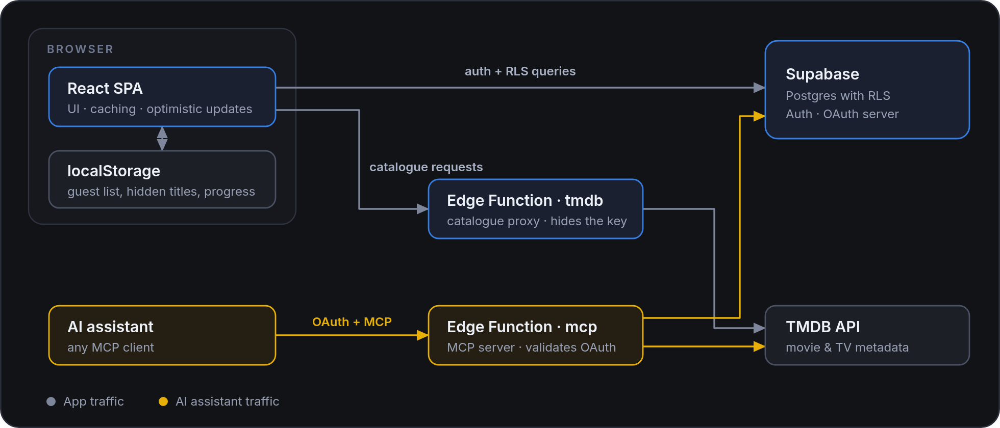
</p>

Data model (see [`supabase/migrations`](supabase/migrations)): `profiles`, `watchlist_items` (status, rating, watched date, runtime), `episode_progress` and `hidden_items`. Every table has Row Level Security so users can only read and write their own rows.

## Quick start

**Prerequisites:** Node 18.18+ (or [Bun](https://bun.sh)), a free [Supabase](https://supabase.com) project, a free [TMDB API key](https://www.themoviedb.org/settings/api) (the v3 key) and the [Supabase CLI](https://supabase.com/docs/guides/cli).

```bash
git clone https://github.com/omsingh02/reel.git
cd reel

bun install            # or: npm install
cp .env.example .env   # then fill in your Supabase values
```

Set up the backend once:

```bash
supabase login
supabase link --project-ref <your-project-ref>

supabase db push                                  # tables, RLS policies, constraints
supabase config push                              # auth URLs, email confirmation, MCP OAuth server
supabase secrets set TMDB_API_KEY=<your-tmdb-key> # server-side only, never a VITE_ variable
supabase functions deploy tmdb                    # TMDB proxy
supabase functions deploy mcp                     # MCP server (the bundle is generated by `vite build`)
```

`supabase/config.toml` is the source of truth for the auth settings (site URL, redirect URLs, the OAuth server for the MCP flow, which sends users to `/oauth/consent`). Change `site_url` and `additional_redirect_urls` to your own domain before running `supabase config push`.

Then start the app:

```bash
bun run dev            # or: npm run dev   →  http://localhost:8080
```

Guest mode works as soon as the `tmdb` function is deployed; sign-in, sync and the MCP server need the rest.

### Scripts

| Command | What it does |
| --- | --- |
| `dev` | Start the Vite dev server on port 8080 |
| `build` | Production build to `dist/` (regenerates the sitemap first) |
| `preview` | Serve the production build locally |
| `typecheck` | Type-check with `tsc` |
| `lint` | Run ESLint |
| `test` / `test:watch` | Run the Vitest suite once / in watch mode |

### Deploying

Reel is a static SPA plus two Supabase edge functions, so it fits the free tiers of [Vercel](https://vercel.com) and [Supabase](https://supabase.com).

1. **Backend:** run the Supabase commands above against your project.
2. **Frontend:** import the repo into Vercel (the Vite preset is detected; [`vercel.json`](vercel.json) adds the SPA rewrite, cache headers and security headers) and set these environment variables for Production and Preview:

   | Variable | Value |
   | --- | --- |
   | `VITE_SUPABASE_URL` | `https://<project-ref>.supabase.co` |
   | `VITE_SUPABASE_PUBLISHABLE_KEY` | the project's publishable (anon) key |
   | `VITE_SUPABASE_PROJECT_ID` | `<project-ref>` (the MCP bundle uses it as the OAuth issuer) |
   | `VITE_SITE_URL` | your public origin, e.g. `https://reel.omsingh.me` |

3. **Domain:** add your domain in Vercel and create the DNS record it asks for, then keep `site_url` in `supabase/config.toml` in step with it.
4. **MCP bundle:** after changing `VITE_SUPABASE_PROJECT_ID`, run `bun run build` once and redeploy the `mcp` function, because the generated bundle bakes in the project's OAuth issuer.

## MCP server

Reel exposes a [Model Context Protocol](https://modelcontextprotocol.io) server at:

```
https://<your-project-ref>.supabase.co/functions/v1/mcp
```

It uses Supabase's OAuth server, so an assistant sends you to Reel's consent screen (`/oauth/consent`) the first time it connects. `supabase config push` turns the OAuth server on and points it at that route (see `[auth.oauth_server]` in `supabase/config.toml`). Tokens are scoped to you; Row Level Security still applies to every query.

| Tool | What it does |
| --- | --- |
| `search_media` | Search TMDB for movies and TV shows by title |
| `get_watchlist` | List your items, optionally filtered by status |
| `add_to_watchlist` | Add a title by TMDB id (never overwrites an existing item) |
| `update_watchlist_item` | Change status (`watchlist` or `watched`) and/or your 1–10 rating |
| `remove_from_watchlist` | Remove a title |

Example with Claude Code:

```bash
claude mcp add --transport http reel https://<your-project-ref>.supabase.co/functions/v1/mcp
```

Then ask things like *"add Dune: Part Two to my list"* or *"mark Severance as watched and rate it 9"*.

> `supabase/functions/mcp/index.ts` is generated from `src/lib/mcp/` every time you run `vite build` (or the dev server). Edit the sources, never the bundle, then redeploy the function.

## Project structure

```
src/
  components/      UI building blocks (shadcn/ui primitives live in components/ui)
  contexts/        Auth context
  hooks/           Data hooks: watchlist, episode progress, hidden titles, show sync
  integrations/    Generated Supabase client and types
  lib/             TMDB client, date helpers, local stores, episode logic, MCP tools
  pages/           Route components
supabase/
  functions/       tmdb (catalogue proxy) and mcp (generated MCP server)
  migrations/      SQL schema and RLS policies
docs/              Brand guide, banner, screenshots
```

A few conventions worth knowing: TMDB dates are plain calendar dates, so always go through `src/lib/dates.ts` instead of `new Date("YYYY-MM-DD")` (which shifts a day west of UTC), and guest and signed-in users share the same hooks, switching storage behind the scenes.

## Contributing

Bug reports, ideas and pull requests are welcome. Read [CONTRIBUTING.md](CONTRIBUTING.md) first, and please follow the [Code of Conduct](CODE_OF_CONDUCT.md). To report a security problem privately, see [SECURITY.md](SECURITY.md).

## Roadmap ideas

Not promises, just where it could go next: import from Letterboxd and Trakt exports, export to CSV/JSON, custom lists, new-episode notifications, genre stats, and a service worker for true offline use.

## License

[MIT](LICENSE) © 2026 omsingh02

## Acknowledgements and attribution

- Movie and TV metadata, images and streaming-availability data come from [TMDB](https://www.themoviedb.org/); availability data is provided by JustWatch via TMDB. **This product uses the TMDB API but is not endorsed or certified by TMDB.**
- UI built with [shadcn/ui](https://ui.shadcn.com), [Radix UI](https://www.radix-ui.com), [Lucide](https://lucide.dev) icons and the [Inter](https://rsms.me/inter/) typeface.
- Posters and artwork in the screenshots belong to their respective owners.
